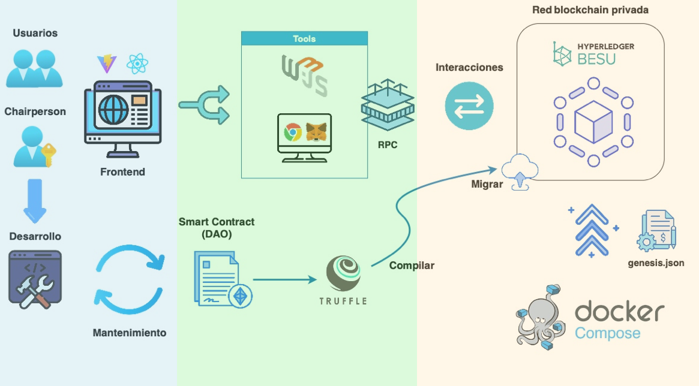

# 🏛️ Red Blockchain Privada con Hyperledger Besu y dApp (DAO)

Este proyecto de **Trabajo de Fin de Máster** se centra en el **diseño y despliegue de una red blockchain privada con Hyperledger Besu**, junto con una **dApp** donde se compila y despliega un **Smart Contract** que implementa la lógica de una DAO.

## 📌 Descripción del Proyecto
El trabajo proporciona una infraestructura reproducible y funcional que incluye:

- **Red blockchain privada con Hyperledger Besu**  
  - Desplegada con **Docker Compose**.  
  - Incluye configuración del nodo Besu, endpoint RPC y puertos necesarios.  
  - Entorno ligero y controlado, ideal para desarrollo local, pruebas y prototipado.  
  - Directorio: [`besu-private-network`](./besu-private-network)

- **Smart Contract DAO**  
  - Desarrollado en **Solidity**.  
  - Desplegado con **Truffle**.  
  - Ejemplo representativo de lógica de gobernanza en una Organización Autónoma Descentralizada.

- **Aplicación descentralizada (dApp)**  
  - Frontend con **React + Vite**.  
  - Integración con **Metamask** para identidad y firma de transacciones.  
  - Comunicación con el contrato mediante **Web3.js**.  
  - Directorio: [`DAO-DApp`](./DAO-DApp)

---

## 🧩 Arquitectura del Proyecto
La siguiente figura muestra la arquitectura general de la solución:

---

## 📖 Guía de Implementación
El repositorio incluye un documento detallado con los pasos de instalación, despliegue y uso del sistema:

📄 **`GuiaImplementacion.docx`**

---

## 🎯 Objetivo
Este proyecto demuestra cómo desplegar de manera eficiente y controlada una red blockchain privada con **Hyperledger Besu**, lista para integrar **aplicaciones descentralizadas (dApps)**.  

Sirve como base sólida y replicable para:
- Desarrolladores que quieran experimentar con contratos inteligentes.
- Equipos técnicos que necesiten un entorno privado para pruebas.
- Prototipado y demostraciones técnicas de soluciones basadas en blockchain.
